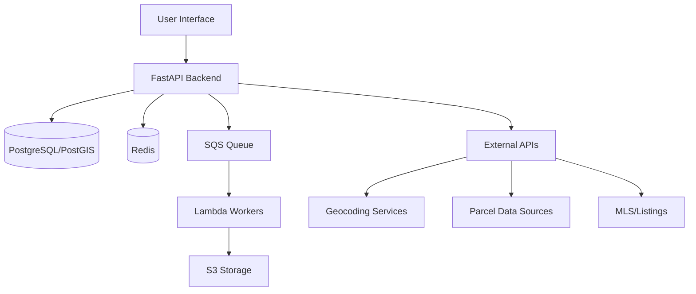
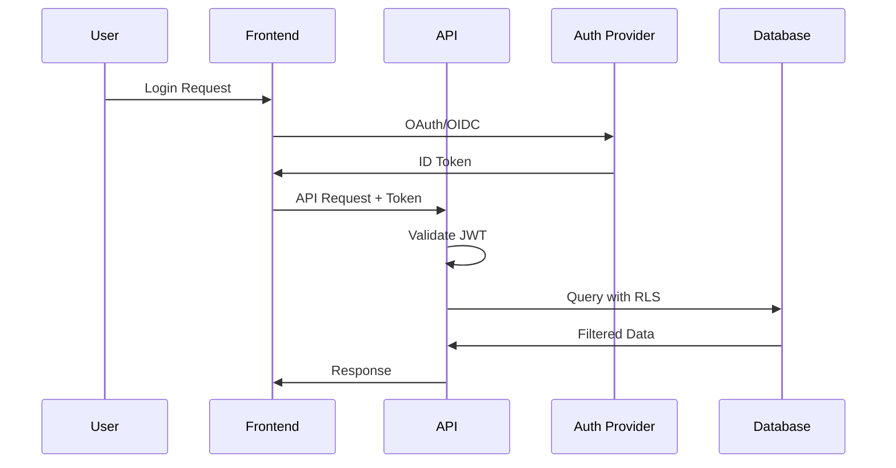

# Architecture Documentation

## System Overview

Backyard Builder Finder is a multi-tenant SaaS platform designed to identify buildable spaces in residential parcels through spatial analysis and data aggregation.

## Core Architecture Principles

### 1. Microservices Architecture
- **Web Frontend**: Next.js application for user interaction
- **API Backend**: FastAPI service for business logic and data processing
- **Batch Processing**: Lambda functions for heavy computations
- **Queue System**: SQS for asynchronous task processing

### 2. Data Flow Architecture



### 3. Multi-Tenant Architecture

Each tenant (organization) has isolated data with row-level security:

```sql
-- Example RLS policy
CREATE POLICY tenant_isolation ON parcels
    USING (org_id = current_setting('app.current_org_id')::uuid);
```

## Component Architecture

### Frontend (Next.js)

```
apps/web/
├── app/                    # App Router pages
│   ├── (auth)/            # Authentication flows
│   ├── (dashboard)/       # Main application
│   └── api/               # API routes
├── components/
│   ├── ui/                # Reusable UI components
│   ├── map/               # MapLibre components
│   └── forms/             # Form components
├── hooks/                 # Custom React hooks
├── lib/                   # Utilities and helpers
└── services/              # API client services
```

### Backend (FastAPI)

```
apps/api/
├── core/                  # Core functionality
│   ├── config.py         # Configuration
│   ├── database.py       # Database setup
│   └── security.py       # Authentication
├── models/               # SQLAlchemy models
├── schemas/              # Pydantic schemas
├── routers/              # API endpoints
├── services/             # Business logic
│   ├── geoprocessing/    # Spatial analysis
│   ├── connectors/       # External data sources
│   └── exports/          # Report generation
└── workers/              # Background tasks
```

## Data Processing Pipeline

### Stage-Based Processing

The system uses a staged pipeline to optimize cost and performance:

1. **Stage A - Coarse Filtering** (Cheap)
   - Query parcels by geographic area
   - Apply basic attribute filters (zoning, lot size)
   - Cost: Database queries only

2. **Stage B - Spatial Analysis** (Medium)
   - Compute backyard polygons
   - Apply setback calculations
   - Subtract building footprints
   - Cost: PostGIS operations

3. **Stage C - Obstacle Detection** (Medium)
   - Identify pools, trees, driveways
   - Apply exclusion zones
   - Cost: Spatial intersections

4. **Stage D - Computer Vision** (Expensive, Optional)
   - Analyze satellite imagery
   - Detect unrecorded structures
   - Cost: ML inference

5. **Stage E - Zoning Evaluation** (Medium)
   - Parse zoning rules
   - Check compliance
   - Cost: Rule engine + optional LLM

6. **Stage F - Fit Testing** (Medium)
   - Test unit placement
   - Optimize orientation
   - Cost: Geometric algorithms

### Caching Strategy

```python
# Multi-level caching
CACHE_LEVELS = {
    'L1_MEMORY': {'ttl': 60},      # In-memory (process)
    'L2_REDIS': {'ttl': 3600},     # Redis (shared)
    'L3_S3': {'ttl': 86400},       # S3 (persistent)
    'L4_DATABASE': {'ttl': None}    # Database (permanent)
}
```

## Spatial Data Architecture

### PostGIS Schema

```sql
-- Spatial indexes for performance
CREATE INDEX idx_parcels_geom ON parcels USING GIST (geom);
CREATE INDEX idx_parcels_centroid ON parcels USING GIST (centroid);

-- Spatial functions
CREATE FUNCTION calculate_buildable_area(
    parcel_id UUID,
    setbacks JSONB
) RETURNS GEOMETRY AS $$
BEGIN
    -- Complex spatial calculation
    RETURN ST_Difference(
        parcel_geom,
        ST_Union(ARRAY[
            setback_polygons,
            building_footprints,
            obstacle_polygons
        ])
    );
END;
$$ LANGUAGE plpgsql;
```

### Coordinate System Management

- Storage: EPSG:4326 (WGS84) for maximum compatibility
- Calculations: Local projected systems for accuracy
- Display: Web Mercator (EPSG:3857) for web maps

## Security Architecture

### Authentication Flow



### API Key Management

```python
# Encrypted storage
class APIKeyManager:
    def store_key(self, user_id: str, provider: str, key: str):
        encrypted = self.kms_client.encrypt(
            KeyId=self.kms_key_id,
            Plaintext=key
        )
        # Store encrypted key in database
        
    def retrieve_key(self, user_id: str, provider: str):
        # Fetch from database
        decrypted = self.kms_client.decrypt(
            CiphertextBlob=encrypted_key
        )
        return decrypted['Plaintext']
```

## Performance Optimization

### Database Optimization

1. **Partitioning**: Parcels table partitioned by region
2. **Indexing**: B-tree for attributes, GiST for geometry
3. **Materialized Views**: Pre-computed aggregations
4. **Connection Pooling**: PgBouncer for connection management

### API Optimization

1. **Request Batching**: Combine multiple operations
2. **Async Processing**: Non-blocking I/O with asyncio
3. **Response Compression**: Gzip/Brotli compression
4. **CDN Caching**: CloudFront for static assets

### Geospatial Optimization

1. **Spatial Indexing**: R-tree indexes for fast lookups
2. **Tile-Based Processing**: Process data in tiles
3. **Simplified Geometries**: Different detail levels by zoom
4. **Vector Tiles**: Mapbox Vector Tiles for efficient rendering

## Monitoring & Observability

### Metrics Collection

```python
# OpenTelemetry instrumentation
from opentelemetry import trace, metrics

tracer = trace.get_tracer(__name__)
meter = metrics.get_meter(__name__)

request_counter = meter.create_counter(
    "api_requests",
    description="Number of API requests"
)

@tracer.start_as_current_span("process_parcel")
def process_parcel(parcel_id: str):
    request_counter.add(1, {"endpoint": "process_parcel"})
    # Processing logic
```

### Logging Strategy

- **Application Logs**: CloudWatch Logs
- **Audit Logs**: Immutable S3 storage
- **Performance Logs**: CloudWatch Metrics
- **Security Logs**: AWS CloudTrail

## Disaster Recovery

### Backup Strategy

1. **Database**: Automated daily snapshots, point-in-time recovery
2. **S3 Data**: Cross-region replication
3. **Configuration**: Version controlled in Git
4. **Secrets**: Backup in separate AWS account

### Recovery Procedures

- **RTO** (Recovery Time Objective): 4 hours
- **RPO** (Recovery Point Objective): 1 hour
- **Automated failover** for critical services
- **Manual failover** for non-critical services

## Scalability Design

### Horizontal Scaling

- **API**: ECS auto-scaling based on CPU/memory
- **Database**: Read replicas for read-heavy workloads
- **Workers**: Lambda concurrent execution limits
- **Cache**: Redis cluster mode

### Vertical Scaling

- **Database**: Automated storage scaling
- **ECS Tasks**: CPU/memory limits adjustable
- **Lambda**: Memory allocation optimization

## Cost Optimization

### Resource Management

1. **Spot Instances**: For batch processing
2. **Reserved Capacity**: For predictable workloads
3. **S3 Lifecycle**: Archive old data to Glacier
4. **Lambda**: Pay-per-execution model

### Data Transfer Optimization

1. **VPC Endpoints**: Avoid NAT gateway costs
2. **CloudFront**: Reduce origin requests
3. **S3 Transfer Acceleration**: For uploads
4. **Database Connection Pooling**: Reduce connection overhead

## Integration Architecture

### External Service Integration

```python
class ConnectorBase:
    """Base class for external service connectors"""
    
    async def fetch_with_retry(self, url: str, max_retries: int = 3):
        for attempt in range(max_retries):
            try:
                return await self.fetch(url)
            except RateLimitError:
                await asyncio.sleep(2 ** attempt)
        raise MaxRetriesExceeded()
    
    @abstractmethod
    async def fetch(self, url: str):
        pass
```

### Webhook Architecture

- **Inbound Webhooks**: For real-time data updates
- **Outbound Webhooks**: For event notifications
- **Retry Logic**: Exponential backoff
- **Dead Letter Queue**: For failed messages

## Development Workflow

### CI/CD Pipeline

```yaml
# Deployment stages
stages:
  - lint
  - test
  - build
  - deploy-staging
  - integration-tests
  - deploy-production
```

### Feature Flags

```python
class FeatureFlags:
    def is_enabled(self, feature: str, user: User) -> bool:
        # Check feature flag service
        return self.flag_service.check(
            feature=feature,
            user_id=user.id,
            org_id=user.org_id
        )
```

## Future Architecture Considerations

### Planned Enhancements

1. **GraphQL API**: For flexible data queries
2. **Event Sourcing**: For audit trail
3. **CQRS Pattern**: Separate read/write models
4. **Micro-frontends**: Independent UI deployment
5. **ML Pipeline**: Dedicated ML infrastructure
6. **Real-time Updates**: WebSocket connections
7. **Mobile Backend**: React Native specific APIs
8. **Blockchain Integration**: For property records

### Technology Upgrades

- Migration to Kubernetes for orchestration
- Adoption of service mesh (Istio)
- Implementation of distributed tracing
- Edge computing for imagery processing

---

This architecture is designed to be scalable, maintainable, and cost-effective while providing the performance required for spatial analysis at scale.